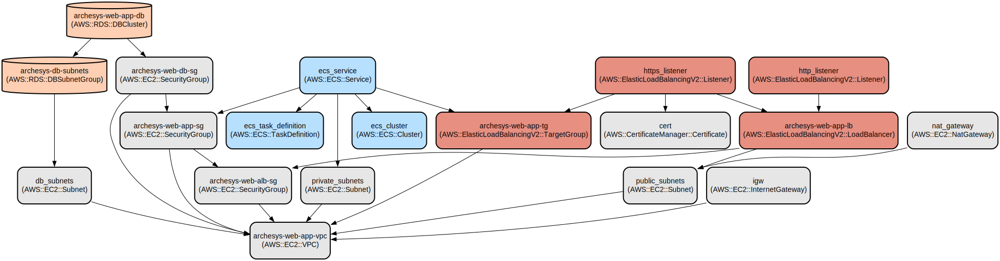

# AWS Infrastructure as Code for Secure Web Application Deployment

This Terraform project automates the deployment of a highly available, secure web application infrastructure on AWS. It provisions a complete environment with load balancing, containerized applications, and managed database services while implementing security best practices and comprehensive monitoring.

The infrastructure includes a multi-AZ VPC setup with public, private, and database subnets, an Application Load Balancer with SSL/TLS termination, an ECS Fargate cluster for container workloads, and an Amazon RDS cluster for database operations. The architecture implements defense-in-depth security through network segmentation, security groups, and SSL/TLS encryption, while CloudWatch monitoring ensures operational visibility.

## Repository Structure
```
.
├── main.tf                 # Core infrastructure definition (VPC, ECS, RDS)
├── alb.tf                  # Application Load Balancer configuration and security groups
├── ssl.tf                  # SSL/TLS certificate and DNS configuration
├── monitoring.tf          # CloudWatch alarms and metrics configuration
├── variables.tf           # Input variables and default values
├── output.tf             # Output definitions for resource attributes
└── .gitignore            # Git ignore patterns for Terraform files
```

## Usage Instructions
### Prerequisites
- AWS CLI installed and configured
- Terraform v0.12.0 or later
- Valid AWS credentials with appropriate permissions
- Registered domain name (for SSL/TLS setup)
- Docker image available in Amazon ECR or public registry

### Installation

1. Clone the repository and navigate to the project directory:
```bash
git clone <repository-url>
cd <project-directory>
```

2. Initialize Terraform:
```bash
terraform init
```

3. Configure required variables by creating a `terraform.tfvars` file:
```hcl
aws_region = "us-east-1"
domain_name = "yourdomain.com"
db_username = "admin"
db_password = "your-secure-password"
container_image = "your-container-image:tag"
```

4. Review the execution plan:
```bash
terraform plan
```

5. Apply the configuration:
```bash
terraform validate
terraform apply
```

### Quick Start
1. Deploy the basic infrastructure:
```bash
terraform apply -var-file="prod.tfvars" -target=aws_vpc.archesys-web-app-vpc
```

2. Configure DNS settings:
```bash
terraform apply -var-file="prod.tfvars" -target=aws_route53_record.alb
```

3. Deploy the application:
```bash
terraform apply -var-file="prod.tfvars"
```

### More Detailed Examples
1. Customizing the VPC CIDR:
```hcl
module "vpc" {
  cidr_prefix = "172.16"
}
```

2. Scaling the ECS service:
```hcl
ecs_desired_task_count = 5
```

### Troubleshooting
1. SSL Certificate Validation Issues
   - Error: `Error creating ACM certificate: ValidationException`
   - Solution: Ensure domain ownership and DNS propagation
   ```bash
   aws acm describe-certificate --certificate-arn <certificate-arn>
   ```

2. ECS Task Definition Failures
   - Check CloudWatch logs:
   ```bash
   aws logs get-log-events --log-group-name /ecs/archesys-web-app --log-stream-name <stream-name>
   ```

## Data Flow
The infrastructure implements a three-tier architecture with secure data flow between components.

```ascii
Internet --> ALB (HTTPS) --> ECS Tasks --> RDS Cluster
    ^                           |
    |                          v
CloudWatch Monitoring <---- CloudWatch Logs
```

Key component interactions:
1. Client requests are terminated at ALB with SSL/TLS
2. ALB routes traffic to ECS tasks in private subnets
3. ECS tasks communicate with RDS through security groups
4. CloudWatch collects metrics and logs from all components
5. NAT Gateway enables outbound internet access for private resources

## Infrastructure


### VPC Resources
- VPC: `aws_vpc.archesys-web-app-vpc`
- Subnets: Public, Private, and Database subnets across 3 AZs
- Internet Gateway and NAT Gateway for connectivity

### Compute Resources
- ECS Cluster: `aws_ecs_cluster.ecs_cluster`
- ECS Service: Running containerized applications
- Task Definition: 512 CPU units, 1024MB memory

### Database Resources
- RDS Cluster: MySQL-compatible Aurora cluster
- Instance Class: db.m5d.large
- Storage: 100GB GP3

### Load Balancer
- Application Load Balancer with HTTP to HTTPS redirect
- SSL/TLS termination with ACM certificate
- Health checks configured for target group

### Monitoring
- CPU and Memory utilization alarms for ECS
- 5XX error rate monitoring for ALB
- Database performance metrics
- Custom CloudWatch dashboards